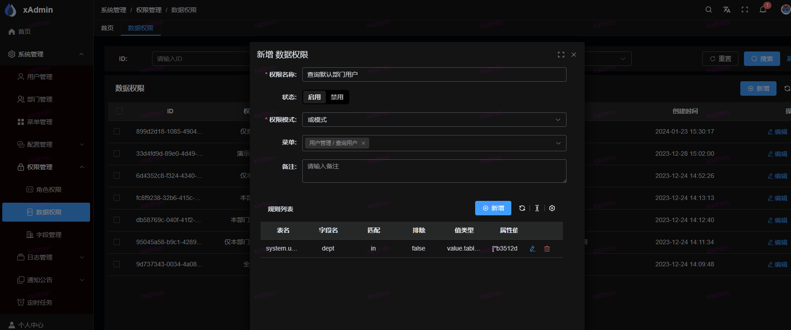
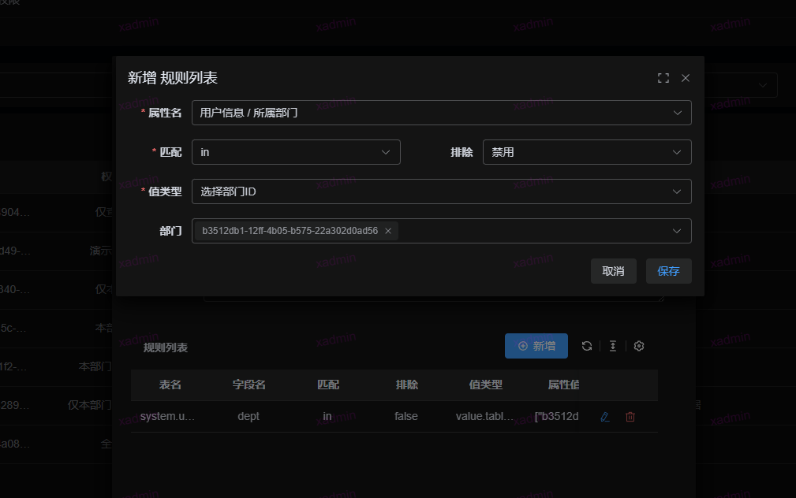

## 数据权限控制

原理： 数据权限是通过 ```queryset.filter``` 来实现。

在 ```settings.py``` 定义了一个全局的```DEFAULT_FILTER_BACKENDS```,
具体方法```common.core.filter.BaseDataPermissionFilter```

！！具体的实现方式参考```common.core.filter.get_filter_queryset```

如果自定义方法使用全局的filter,可以通过下面获取queryset对象

```python
filter_queryset = self.filter_queryset(self.get_queryset())
```

1. 权限模式, 且模式表示数据需要同时满足规则列表中的每条规则，或模式即满足任意一条规则即可
2. 若存在菜单权限，则该权限仅针对所选择的菜单权限生效

## 如何使用？本次使用是查询指定条件用户的数据权限

### 1. 在前端页面菜单中，添加数据权限，然后选择菜单为查询用户，规则选择





匹配 里面的字段参考： https://docs.djangoproject.com/zh-hans/5.0/ref/models/querysets/#field-lookups

将该数据权限分配给用户即可

# 详细原理步骤 ```common.core.filter.get_filter_queryset```

1.为了方便数据权限，需要定义一下全局字段，根据业务需求进行修改或增删，这些字段需要存在所有的表中

```python
class DbAuditModel(DbBaseModel):
    creator = models.ForeignKey(to=settings.AUTH_USER_MODEL, related_query_name='creator_query', null=True, blank=True,
                                verbose_name='创建人', on_delete=models.SET_NULL, related_name='+')
    modifier = models.ForeignKey(to=settings.AUTH_USER_MODEL, related_query_name='modifier_query', null=True,
                                 blank=True, verbose_name='修改人', on_delete=models.SET_NULL, related_name='+')
    dept_belong = models.ForeignKey(to="system.DeptInfo", related_query_name='dept_belong_query', null=True, blank=True,
                                    verbose_name='数据归属部门', on_delete=models.SET_NULL, related_name='+')
```

2.数据权限查询的时候，分两种，一种是部门权限，一种是用户单独授权，这两种权限是或模式，也就是任意匹配对应权限就返回

```python
    if not SysConfig.PERMISSION_DATA or queryset is None:
        return queryset

    if user_obj.is_superuser:
        logger.debug(f"superuser: {user_obj.username}. return all queryset {queryset.model._meta.label_lower}")
        return queryset

    # table = f'*'
    dept_obj = user_obj.dept
    q = Q()
    dq = Q(menu__isnull=True) | Q(menu__isnull=False, menu__pk=getattr(user_obj, 'menu', None))
    has_dept = False
    if dept_obj:
        # 存在部门，递归获取部门，类似树结构，部门权限需要且模式，将获取到的所有部门的数据规则通过且操作
        dept_pks = DeptInfo.recursion_dept_info(dept_obj.pk, is_parent=True)
        for p_dept_obj in DeptInfo.objects.filter(pk__in=dept_pks, is_active=True):
            # 获取对应的数据权限
            permission = DataPermission.objects.filter(is_active=True).filter(deptinfo=p_dept_obj).filter(dq)
            # 将数据权限且操作
            q &= get_filter_q_base(queryset.model, permission, user_obj, dept_obj)
            has_dept = True
        if not has_dept and q == Q():
            q = Q(id=0)
        if has_dept and q == Q():
            return queryset
    # 获取个人单独授权规则
    permission = DataPermission.objects.filter(is_active=True).filter(userinfo=user_obj).filter(dq)
    #不存在个人单独授权，则返回部门规则授权
    if not permission.count():
        logger.warning(f"get filter end. {queryset.model._meta.label} : {q}")
        if has_dept:
            return queryset.filter(q)
        else:
            return queryset.none() # 没有任何授权，返回 none
    q1 = get_filter_q_base(queryset.model, permission, user_obj, dept_obj)
    if q1 == Q():
        q = q1
    else:
        q |= q1 # 存在部门规则和个人规则，或操作
    logger.warning(f"get filter end. {queryset.model._meta.label} : {q}")
    return queryset.filter(q)
```

