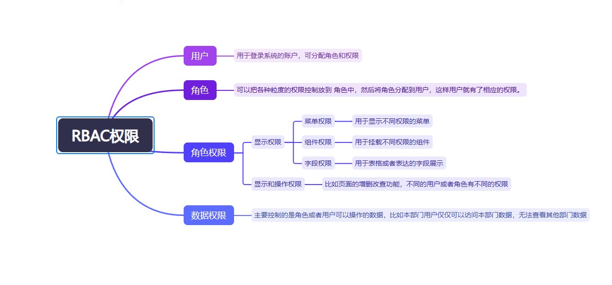
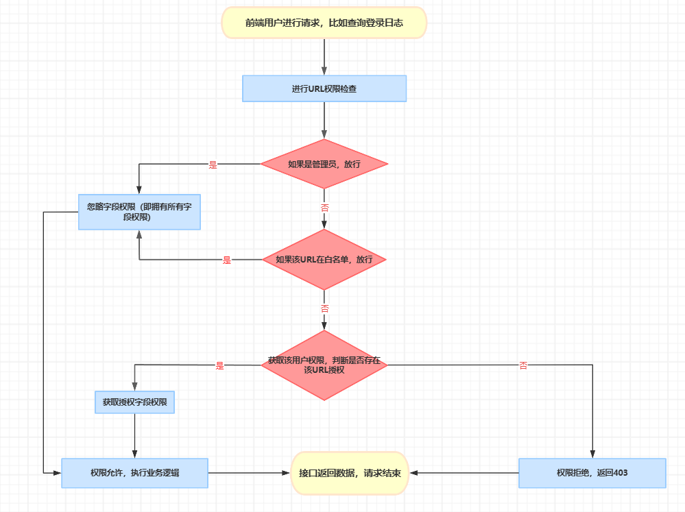

# RBAC权限控制 （Role Based Access Control）权限指的是基于角色的访问控制



## 前端权限:前端权限主要是控制 页面和按钮展示用

该权限是通过路由接口获取的 [initRouter](https://github.com/nineaiyu/xadmin-client/blob/main/src/router/utils.ts#L194)

## 1.菜单权限

### 实现原理、代码

页面整体的菜单存放在 [wholeMenus](https://github.com/nineaiyu/xadmin-client/tree/main/src/store/modules/permission.ts#L15)
，所以我们只需要控制 wholeMenus 就能控制菜单的显示、隐藏。

## 2.按钮、组件权限

### 函数方式判断权限

按钮、组件、类方法权限都可用

### 实现原理、代码

通过 [hasAuth](https://github.com/nineaiyu/xadmin-client/blob/main/src/router/utils.ts#L382) 函数判断某些按钮、组件、类方法是否有按钮级别的权限

```vue

<el-button type="success" v-if="hasAuth('list:demoBook')">
  拥有 'list:demoBook' 权限可见
</el-button>
```

```ts
hasAuth("list:demoBook") ? "显示" : "隐藏";
```

## demo 示例

简单的增删改查权限，一般定义为

```ts
  const auth = reactive({
    list: hasAuth("list:demoBook"),
    create: hasAuth("create:demoBook"),
    delete: hasAuth("delete:demoBook"),
    update: hasAuth("update:demoBook"),
    export: hasAuth("export:demoBook"),
    import: hasAuth("import:demoBook"),
    batchDelete: hasAuth("batchDelete:demoBook")
});
```

```hasAuth("list:demoBook")``` 里面的```list:demoBook``` 是通过菜单管理中的权限进行添加的

## 后端权限

## 1.角色权限，该权限包含两种 源码```common.core.permission.IsAuthenticated.has_permission```

- 请求权限，每个请求的URL地址
- 字段权限，所展示或者编辑的字段

请求角色判断流程如下


## 前端页面渲染表格或者表单

- 1.请求 ```search-columns``` 接口，拿到表格或者表单字段，用于渲染表格或者表单
- 2.请求 ```search-fields``` 接口，拿到搜索字段，用于渲染搜索
- 3.请求对应接口，拿到对应数据
