# 1.服务端本地容器化开发

环境依赖：Docker 环境 [下载](https://www.docker.com) 并安装运行 docker desktop

为了防止容器过度使用机器资源，可将内存资源限制为2G (内存充足可忽略)

- [Windows 资源限制](https://learn.microsoft.com/zh-cn/windows/wsl/wsl-config#configure-global-options-with-wslconfig)

# ！！！ 注意
每当依赖(pyproject.toml / uv.lock 或Python版本)有更新，必须在xadmin-server项目目录下，执行构建容器镜像命令``` docker compose build```

## Pycharm 配置开发

### 1.打开pycharm，进行配置，操作如下：

- 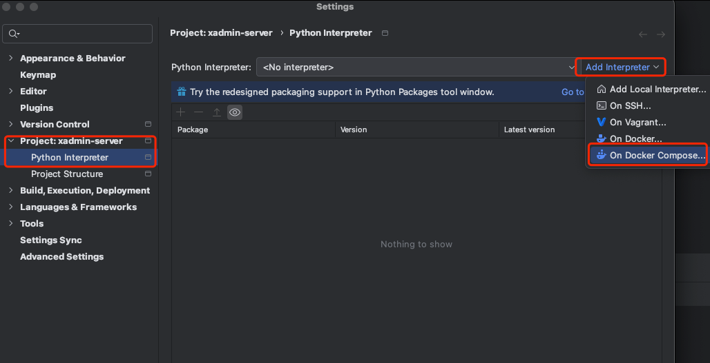
- 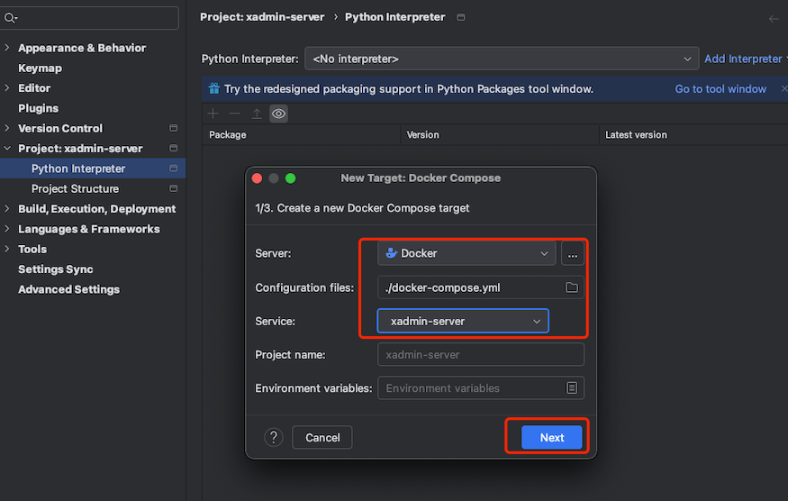
- 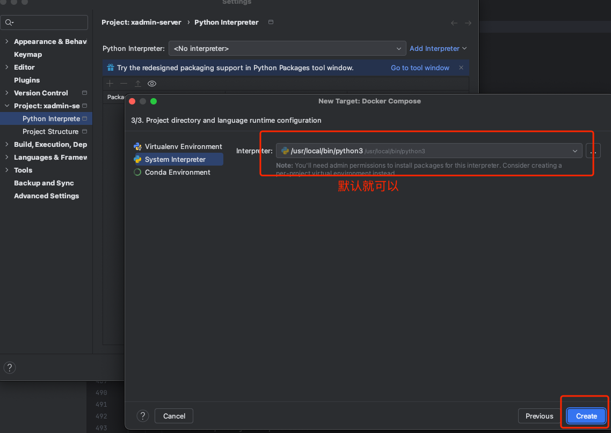
- 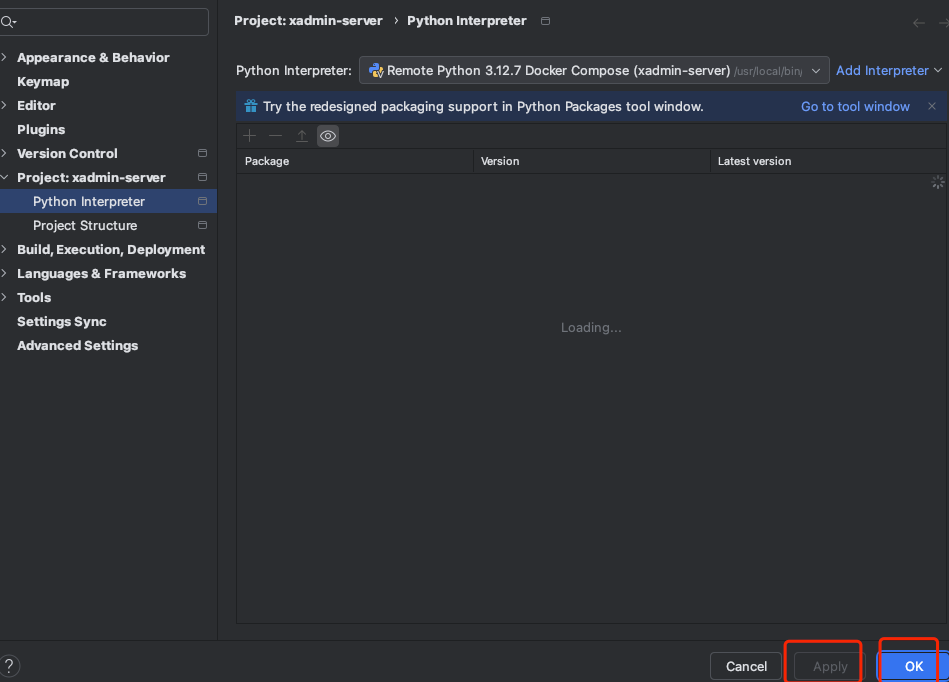

### 2.如果有异常，可能需要退出，重新启动pycharm

### 3.启动服务进行开发

- 编辑Django启动配置
  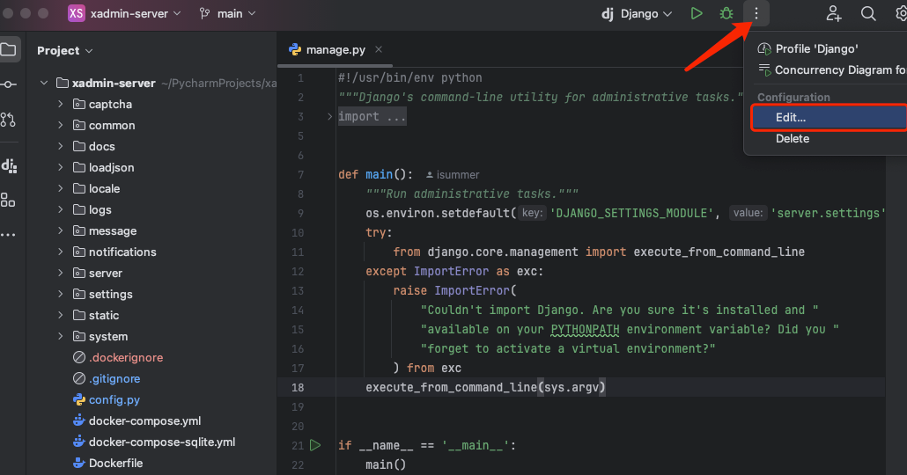
- 修改主机地址和端口
  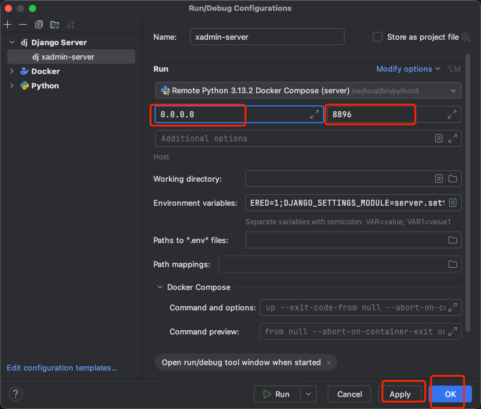
- 点击运行按钮，启动服务
  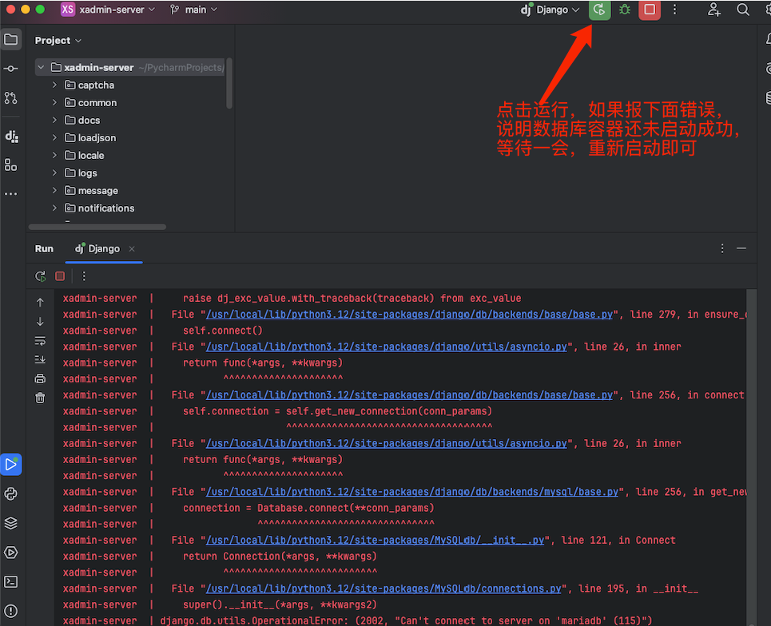
  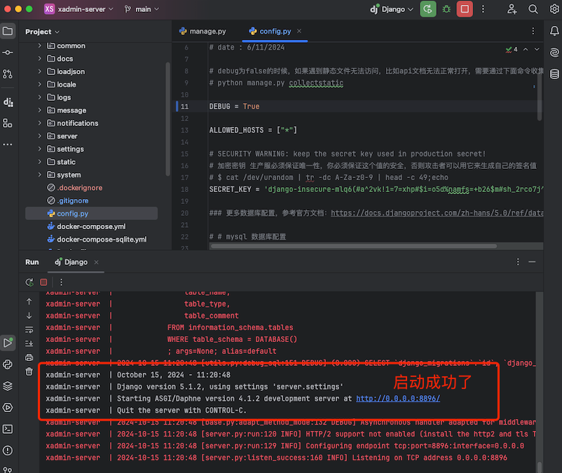

## visual studio code 配置使用

安装容器化开发插件
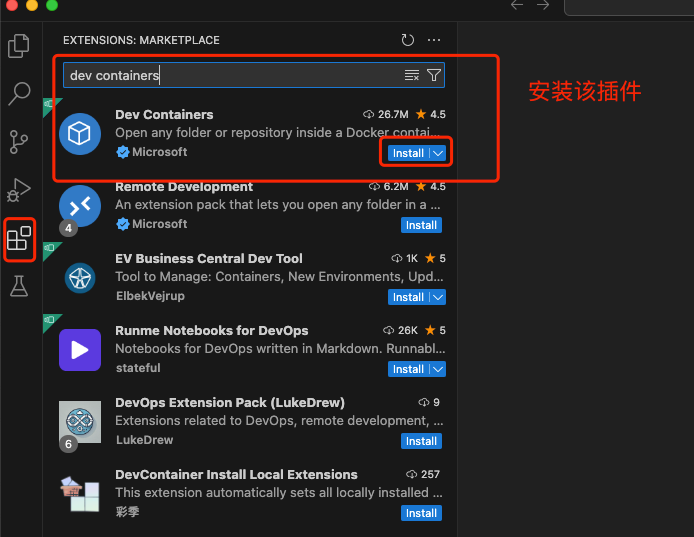
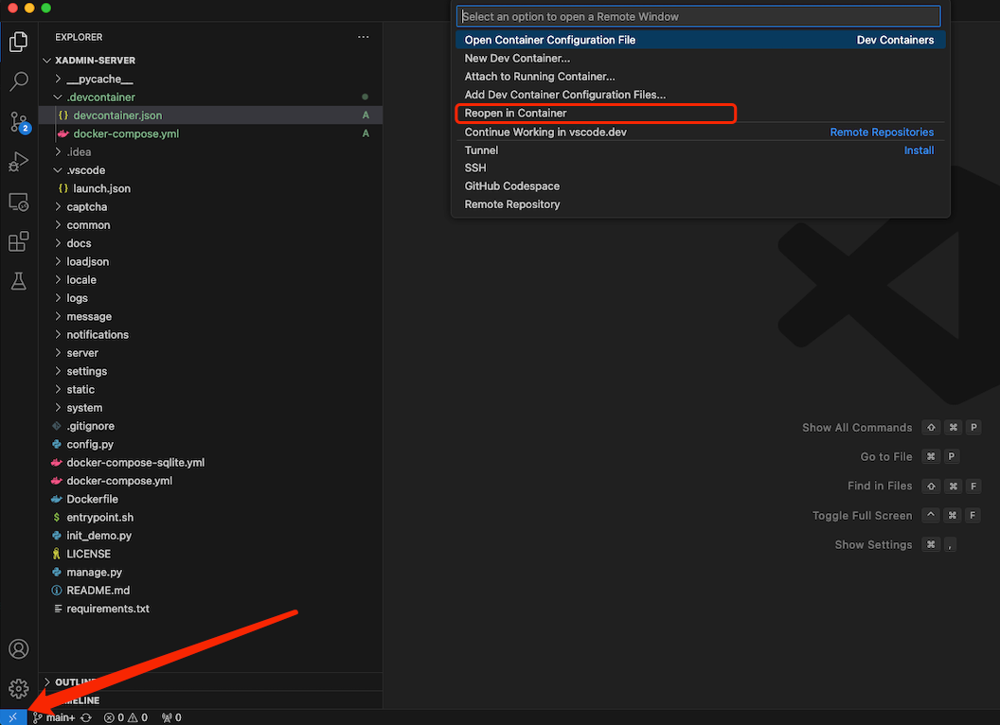
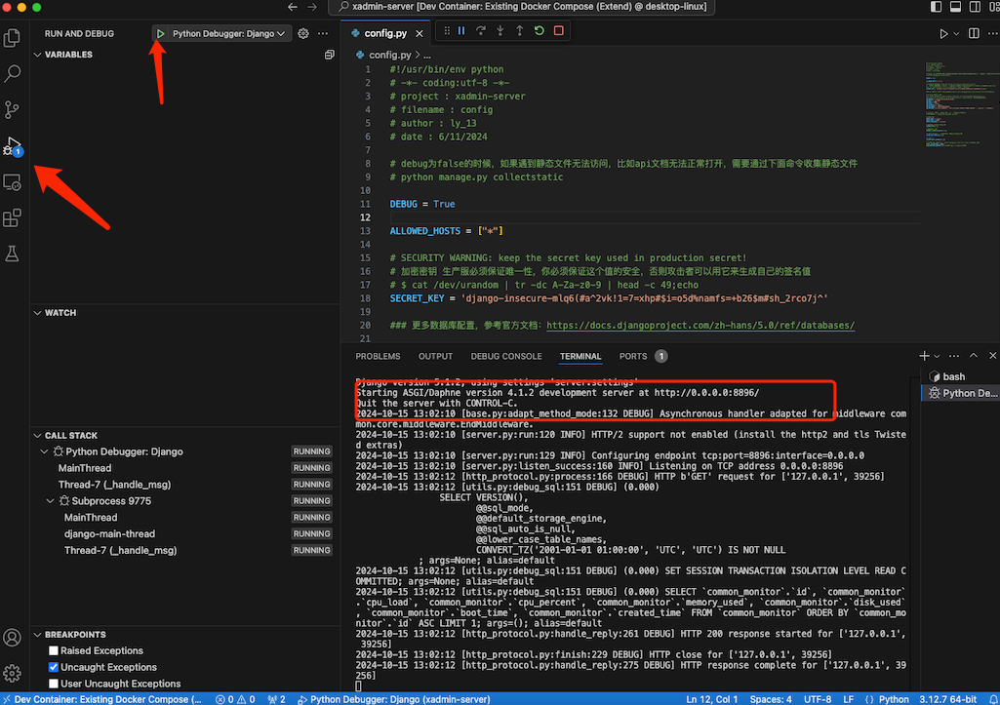

# 2.远端开发，需要配置Redis，postgresql，python 环境

不限平台

# 3.本地开发，需要配置Redis，postgresql，python 环境

前端不限平台

后端支持mac, 有限支持Windows， Windows平台无法正常启动任务监控命令

# 4. 分层与命名约定

- **app 布局**：`models/`（或单文件）、`serializers/`、`views.py`、`urls.py`、`config.py`
  （`URLPATTERNS` 自动注入总路由 + `PERMISSION_WHITE_REURL` 白名单）。完整链路见
  [example/new-app-api.md](../example/new-app-api.md)；
- **新业务能力一律独立 app**，不要往 `system` 里加（`system` 已冻结扩容）；
- **ViewSet**：资源名 + `ViewSet`，继承 `BaseModelSet` 等（选型见
  server `docs/architecture/framework-cookbook.md`）；**docstring 必写**——菜单与
  访问日志的显示名取自它；
- **权限码**：PERMISSION 菜单 `name` = `动作:组件名`（见
  [example/new-app-menu.md](../example/new-app-menu.md)）；
- **响应**：统一 `ApiResponse`（`code=1000` 成功），不要自造响应形状。

# 5. 测试规范

- 后端 pytest（`tests/unit` + `tests/integration`）、前端 vitest、E2E playwright 的
  范式与运行命令见 [example/new-app-test.md](../example/new-app-test.md)；
- 红线：新功能 100% 携带测试（CI 阻断）；改动后端后跑 `pnpm test:e2e:fresh`；
- 前后端契约变更：先改 server `docs/schema/`，再 `pnpm gen:metadata-types` 重新生成类型。
