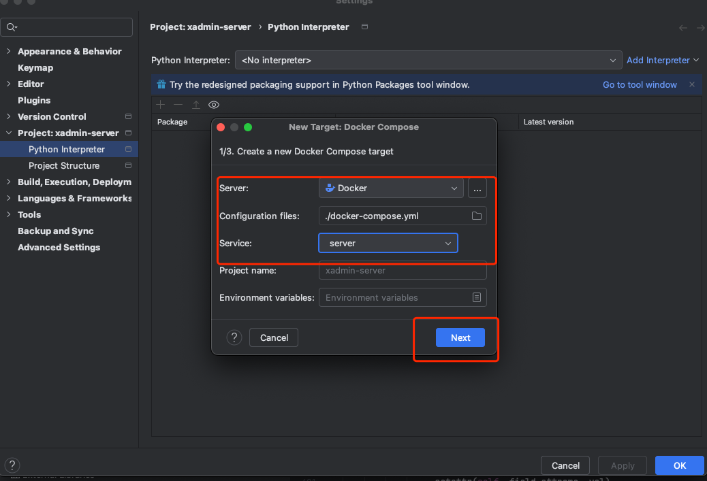
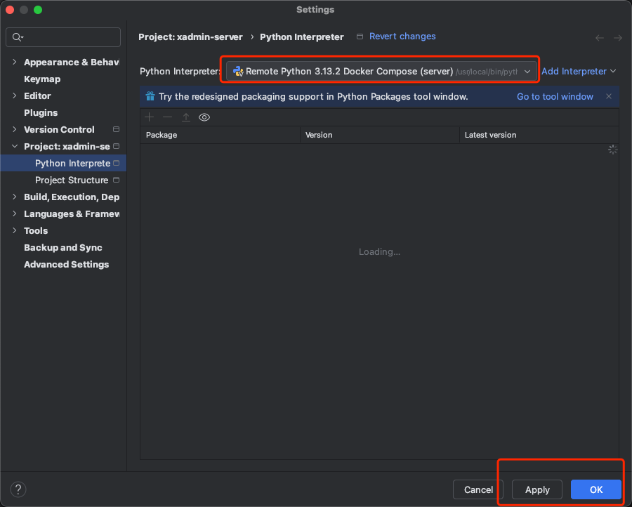

# 1.服务端本地容器化开发【推荐】

环境依赖：Docker 环境 [下载](https://www.docker.com) 并安装运行 docker desktop

## Pycharm 配置开发

### 1.打开pycharm，进行配置，操作如下：

- 
- 
- 

### 2.如果有异常，可能需要退出，重新启动pycharm

### 3.启动服务进行开发

- 编辑Django启动配置
  
- 修改主机地址和端口
  
- 点击运行按钮，启动服务
  
  

## visual studio code 配置使用

安装容器化开发插件

# 2.远端开发，需要配置Redis，mariadb，python 环境

不限平台

# 3.本地开发，需要配置Redis，mariadb，python 环境

前端不限平台

后端支持mac, 有限支持Windows， Windows平台无法正常启动任务监控命令
