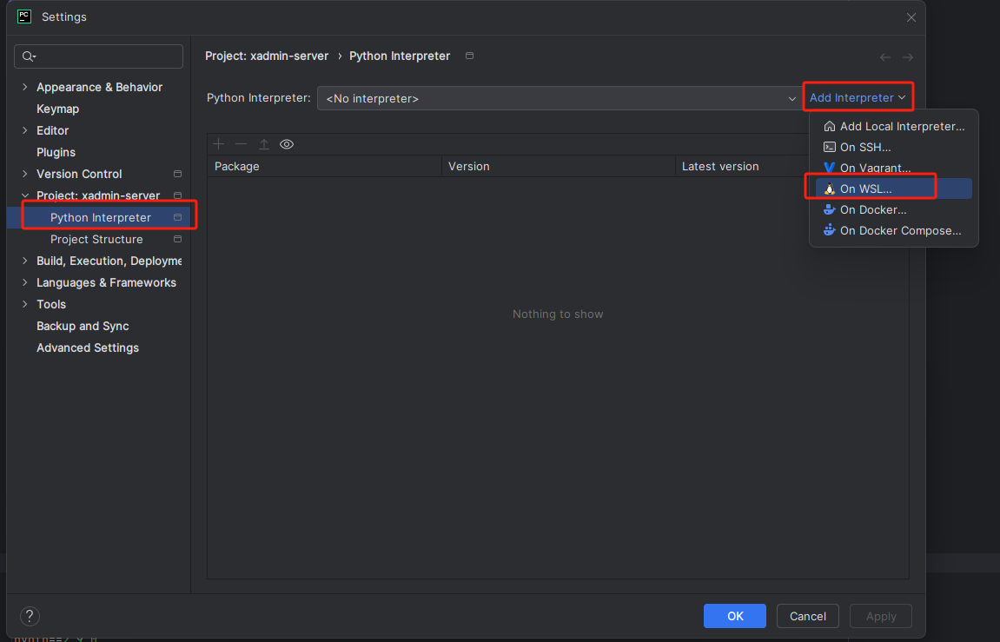

# windows11 下本地开发环境搭建

# 一.基础环境安装【仅操作一次】基于Windows中wsl操作
## 1.wsl Ubuntu子系统安装
打开cmd命令框，输入下面命令，根据提示操作
```shell
wsl --install
```
根据提示输入用户名和密码

## 为了方便操作，建议切换root用户进行操作
```shell
sudo su   # 输入上面的密码
```

## 2.环境依赖更新
```shell
apt update -y
```

## 3安装postgresql依赖环境
```shell
apt install postgresql-16 -y
systemctl enable postgresql
systemctl restart postgresql
```
创建数据库并添加授权

```shell
su - postgres
```

```shell
cat <<EOF > create_and_permission.sql
-- 创建数据库
create database xadmin;

-- 创建用户并设置密码
CREATE USER server WITH PASSWORD 'KGzKjZpWBp4R4RSa';

-- 授予用户对数据库的所有权限
GRANT ALL PRIVILEGES ON DATABASE xadmin TO server;

-- 切换到xadmin数据库
\c xadmin;

-- 授予用户对 schema 的使用和创建权限
GRANT USAGE ON SCHEMA public TO server;
GRANT CREATE ON SCHEMA public TO server;

-- 授予用户对 schema 中现有对象（如表和序列）的权限
GRANT ALL PRIVILEGES ON ALL TABLES IN SCHEMA public TO server;
GRANT ALL PRIVILEGES ON ALL SEQUENCES IN SCHEMA public TO server;

-- 配置默认权限，确保未来创建的表和序列也授予用户权限
ALTER DEFAULT PRIVILEGES IN SCHEMA public GRANT ALL ON TABLES TO server;
ALTER DEFAULT PRIVILEGES IN SCHEMA public GRANT ALL ON SEQUENCES TO server;
EOF

psql -f create_and_permission.sql

exit

```

## 4.安装启动Redis，并设置所需密码和hosts解析

```shell
apt install redis-server -y
echo -e '\nrequirepass nineven' >> /etc/redis/redis.conf   # 用于添加redis密码
systemctl enable redis-server
systemctl restart redis-server
```

## 4.a 添加本地解析，由于wsl子系统重启之后，解析会自动失效，需要使用配置``` /etc/wsl.conf```自动添加解析

```shell
sudo vim  /etc/wsl.conf
```

在```[boot]```添加下面内容

```shell
command="echo 127.0.0.1 redis postgresql >> /etc/hosts"
```

```/etc/wsl.conf``` 内容大致如下

```shell
[boot]
command="echo 127.0.0.1 redis postgresql >> /etc/hosts"
systemd=true
```

## 5.安装Python环境

```shell
add-apt-repository ppa:deadsnakes/ppa -y
apt install python3.13 python3.13-venv python3.13-dev pkg-config libmariadb-dev gettext curl make g++ -y
```

## 6.创建虚拟环境，使用普通用户，上面的操作都是root用户

```shell
exit # 退出root用户
cd   # 切换到家目录
python3.13 -m venv py313
```

#### 切记，上面的操作都在Windows的子系统中操作，下面的操作在编辑器中操作

---

# 二.服务端开发操作

## 7.修改 server 配置文件,复制```config_example.yml```为```config.yml```

- a.将config.yml里面的 ```DB_PASSWORD```，```REDIS_PASSWORD```，```DEBUG``` 取消注释

- b.随机生成并填写 ```SECRET_KEY```， 随便写一些字符就行

- c.将```DB_HOST```和```REDIS_HOST```的值修改为```127.0.0.1```

## 8.开启子系统，且该窗口不可以关闭，若关闭，则Redis和Postgresql 服务将会终止，在cmd中通过下面该命令启动子系统

```shell
wsl -d Ubuntu
```

## 使用pycharm配置，第9步到12步，需要在子系统里面操作

这个路径是根据本地路径来的，比如我的代码路径```w:\sources\xadmin-server```，则对应的子系统路径为
```/mnt/w/sources/xadmin-server/```

```shell
cd
source py313/bin/activate
cd /mnt/w/sources/xadmin-server/
```

## 9.生成数据表并迁移【server中所需的Python3.13.2环境和依赖自行安装】

```shell
python manage.py makemigrations
python manage.py migrate
```

## 10.编译国际化，下载IP数据库
```shell
python manage.py compilemessages  # 如果该命令报错，提示找不到msgfmt，参考第12个常见问题
python manage.py download_ip_db -f
```

## 11.创建超级管理员

```shell
python manage.py createsuperuser
```

## 12.导入默认菜单，权限，角色等数据（仅新部署执行一次）

```shell
python manage.py load_init_json
```

## 13.启动程序

### A.手动执行命令【下面命令一般是开发阶段操作】

#### 1.api服务

```shell
python manage.py runserver 0.0.0.0:8896
```

#### 2.定时任务

```shell
python -m celery -A server beat -l INFO --scheduler django_celery_beat.schedulers:DatabaseScheduler --max-interval 60
```
```shell
python -m celery -A server worker -P threads -l INFO -c 10 -Q celery --heartbeat-interval 10 -n celery@%h --without-mingle
```

#### 3.任务监控[可能某些Windows系统无法正常运行，导致页面打不开]

```shell
python -m celery -A server flower -logging=info --url_prefix=api/flower --auto_refresh=False  --address=0.0.0.0 --port=5566
```

## 14.Pycharm配置




## 使用其他编辑器启动服务[自行配置]