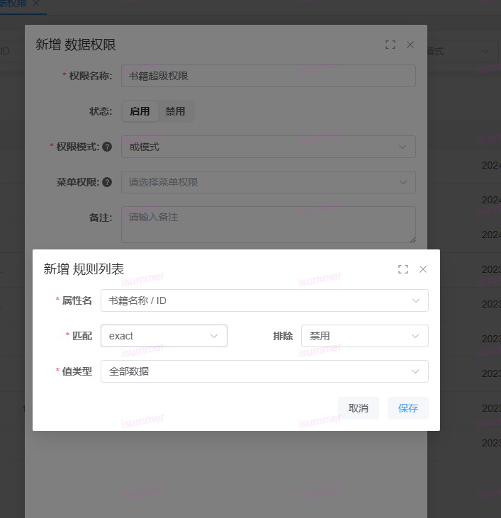
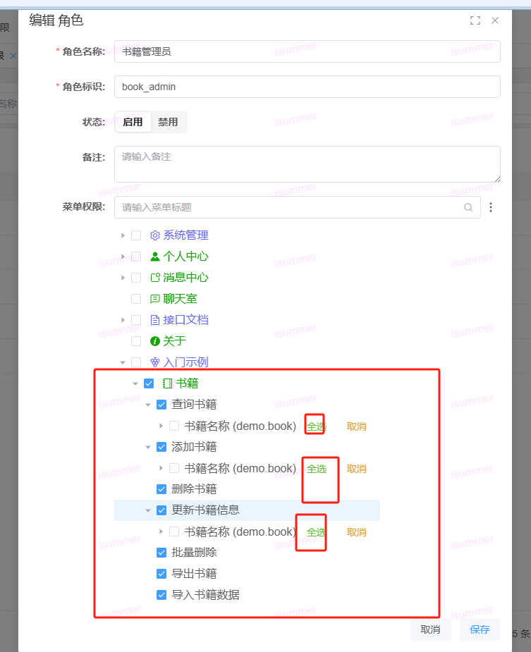
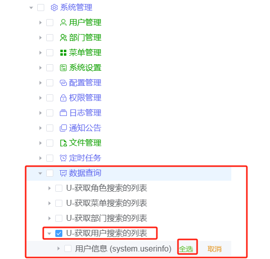
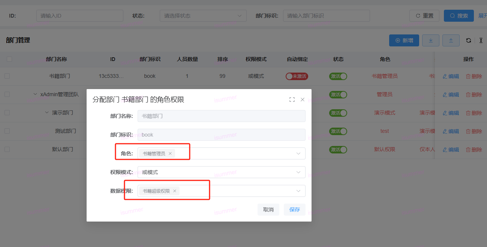
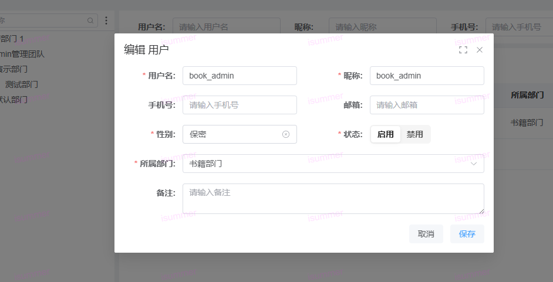

# 为书籍表添加数据权限与字段权限

> **教程定位**：手写理解版。按任务索引的步骤另见
> [recipes R7/R8](https://github.com/nineaiyu/xadmin-server/blob/dev/docs/guide/recipes.md)；
> 权威文档索引见[二次开发文档地图](/guide/index#二次开发文档地图)。

> 机制原理（`queryset.filter` + `BaseDataPermissionFilter` / `get_filter_queryset`）见
> server 仓库 [docs/architecture/data-permission.md](https://github.com/nineaiyu/xadmin-server/blob/dev/docs/architecture/data-permission.md)。
> 本章只讲二开者视角的操作步骤：把"谁能看到/操作哪些行、哪些字段"配置出来。

## 前置：确认数据权限机制已挂载

全局 `DEFAULT_FILTER_BACKENDS` 已内置 `BaseDataPermissionFilter`，继承框架
`BaseViewSet` 的视图自动生效，无需在业务 ViewSet 里额外声明。

## 1. 打开前端权限管理->数据权限页面，添加书籍的增删改查权限

要点：

- 数据权限条目需**关联到菜单权限码**（选择上一步在
  [new-app-menu.md](./new-app-menu.md) 里建的 PERMISSION 条目）——该规则只对所选权限生效；
- 规则列表支持**且模式**（同时满足每条规则）与**或模式**（满足任意一条）。

## 2. 打开前端权限管理->角色权限页面，添加书籍的角色，记得选中里面的字段，否则普通用户显示异常

角色授权即字段权限的分配入口：勾选菜单权限码时**同时勾选可见字段**。漏勾字段是普通用户
页面显示异常的第一原因。

### 添加搜索组件中 搜索用户的权限

页面上"选人/选部门"等搜索下拉组件同样是权限码控制的（如 `list:SearchUser`）。
二开页面若用到搜索组件，记得为对应权限码建 PERMISSION 菜单并授权，否则下拉为空。

## 3.创建一个书籍部门，授权相关权限

## 4.创建用户，加入该部门，则用户拥有该书籍权限

## 5. 代码侧自定义（可选）

规则引擎覆盖不了的动态逻辑（如"仅本人 + 按表单字段匹配"组合），在模型/视图层覆写：
查询集过滤统一走 `get_filter_queryset`，不要在业务 ViewSet 里手写裸 `queryset.filter`
绕过框架（会绕过数据权限与审计口径）。

## 6. 验证

- 用步骤 4 的普通用户登录：列表只出现规则范围内数据、字段只出现角色勾选字段；
- 用超管登录对照：全量数据与全字段可见。
