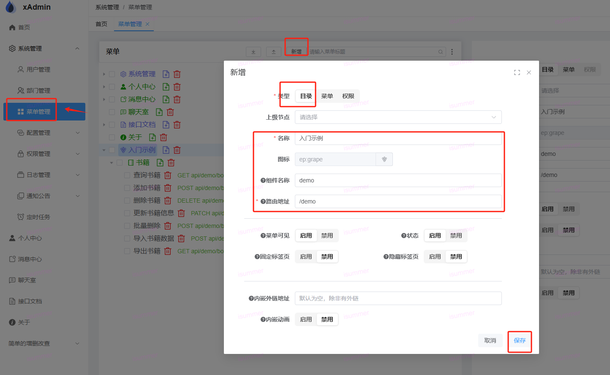
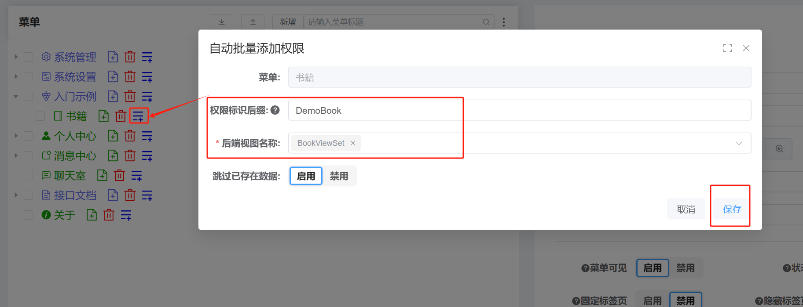
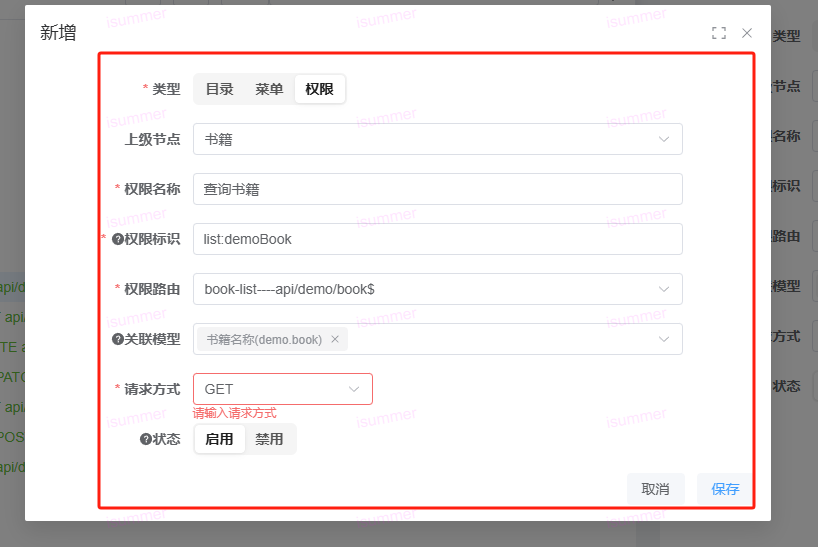

# 添加菜单

## 1. 打开前端菜单页面，添加目录

## 2. 添加菜单

## 3.添加权限


## 权限标识一般如下
```ts
  const auth = reactive({
    list: hasAuth("list:demoBook"),
    create: hasAuth("create:demoBook"),
    delete: hasAuth("delete:demoBook"),
    update: hasAuth("update:demoBook"),
    export: hasAuth("export:demoBook"),
    import: hasAuth("import:demoBook"),
    batchDelete: hasAuth("batchDelete:demoBook")
});
```

## 该demo菜单附件如下，可直接下载导入到菜单中
[export_menu_2024-06-12_16-24-14.xlsx.zip](assets/export_menu_2024-06-12_16-24-14.zip)
