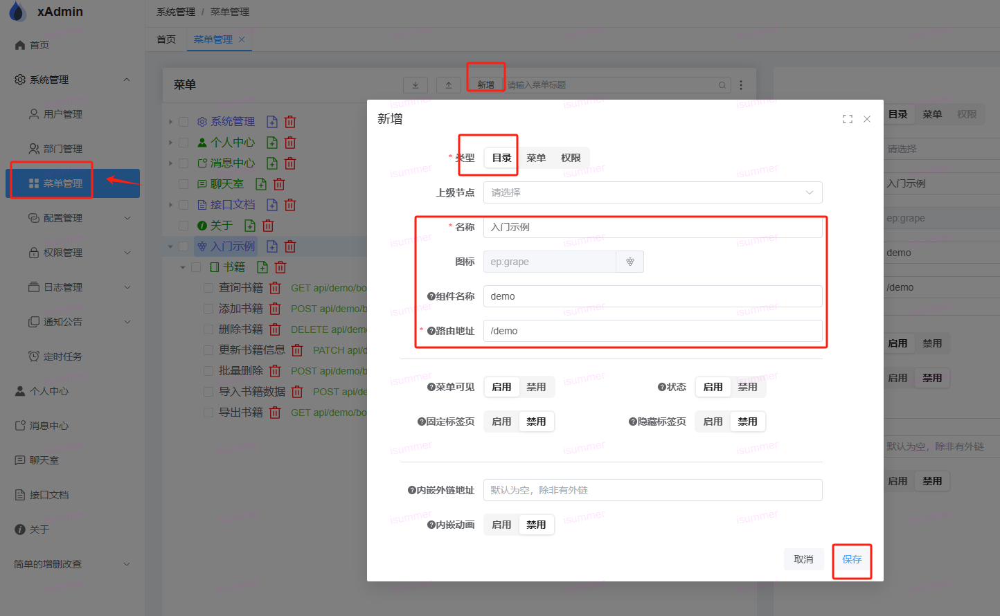
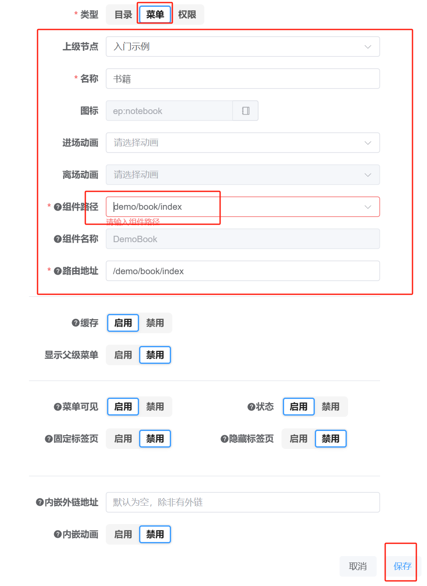
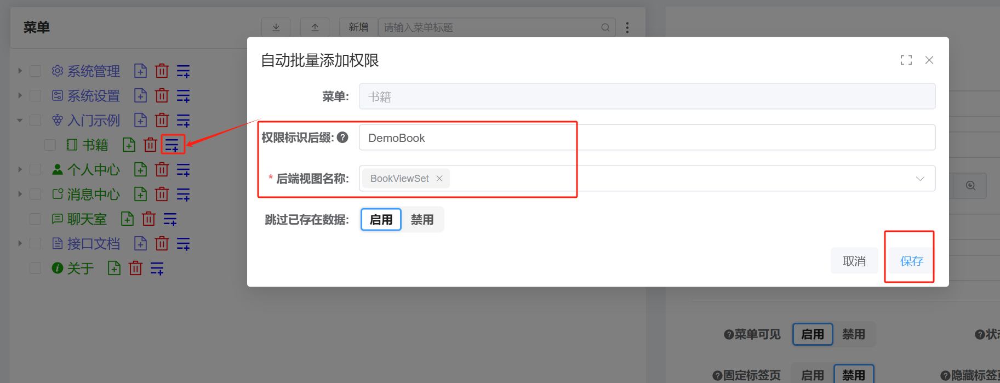
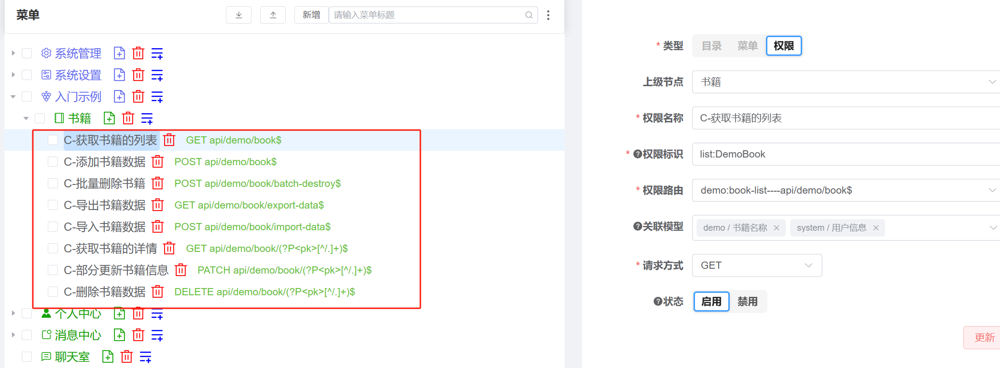

# 添加菜单（目录 / 菜单 / 权限码）

> 菜单是本框架权限体系的入口：前端路由显隐、按钮权限、接口路径鉴权、字段权限的数据源
> 全部来自菜单表。模型定义完成后（见 [new-app-api.md](./new-app-api.md)），必须完成本章的
> 菜单/权限码注册，业务功能才对用户可见。

## 1. 三种菜单类型

| 类型 | 值 | 作用 | 关键字段 |
|------|----|------|----------|
| 目录（DIRECTORY） | 0 | 侧边栏分组节点，不对应页面 | `meta`（标题/图标/排序） |
| 菜单（MENU） | 1 | 对应一个前端页面 | `component` + `meta` |
| 权限码（PERMISSION） | 2 | 一个接口/按钮的权限位，**不出现在侧边栏** | `name` + `path` + `method` + `model` |

## 2. 关键字段约定（务必先读）

### `name` —— 权限码

权限码（PERMISSION 类型）的 `name` 格式为 **`动作:组件名`**，是前端按钮权限的判断依据：

- 动作与 DRF action 对齐：`list` / `create` / `update` / `partialUpdate` / `destroy` /
  `retrieve` / `batchDestroy` / `exportData` / `importData` / `recycleList` / `upload`；
- 组件名 = 前端页面组件的 `name`（如 `SystemUser`、`SystemRole`），框架按组件名自动匹配
  （`getDefaultAuths(instance)` 会生成该页面全部动作的权限 map）；
- 自定义 action 同理，如任务中心的 `stats:SystemExportRecord`、审批的
  `pendingCount:SystemApprovalRequest`、角色的 `preview:SystemRole`。

后端登录后经 `system/views/routes.py` 的 `get_auths()` 把当前用户拥有的权限码数组随路由
下发给前端（`permissionAuths`），前端 `hasAuth("list:SystemUser")` 即时判断。

### `path` + `method` —— 接口路径鉴权

PERMISSION 类型的 `path` 填**接口路径正则**（如 `api/system/user$`），`method` 填 HTTP 方法
（GET/POST/...）。菜单路径级 API 鉴权据此判定：用户请求了未授权的接口路径会被拒绝——
这是前端隐藏之外的**后端兜底**。

### `model` —— 关联模型（重要）

权限码必须通过 `model` 多选关联到业务模型：普通用户的**可见字段**（字段权限）与列表元数据
都以该关联为数据源。不关联模型，普通用户页面会出现字段显示异常——这是新手最常踩的坑。

### `component` —— 前端组件路径

MENU 类型填前端 `src/views/` 下的组件路径（不带扩展名），如 `system/user/index` 对应
`src/views/system/user/index.vue`。动态路由按此字符串映射渲染。

### `meta` —— 展示元信息

`meta` 关联菜单元数据（标题/图标/排序 `rank`/是否显示 `showLink`），标题走 i18n 词条。

## 3. 在前端页面添加（推荐，跟随原教程截图）

## 1. 打开前端菜单页面，添加目录

## 2. 添加菜单

## 3.添加权限，权限一定要关联模型，否则普通用户将无法显示正常字段，可以参考菜单中，配置管理下面的用户配置进行参考

## 支持自动添加权限

一般会在查询、更新、添加、接口绑定关联模型

可以看到，已经自动将权限生成

注意！ 自动绑定权限是扫描该表关联的所有模型，要检查下所设置的权限中，模型绑定是否正常

## 4. 用种子文件批量注册（可选）

生产种子放在 server 仓库 `loadjson/`（`menu.json` / `menumeta.json`），格式为
`{model, pk, fields}` 的 Django fixture 风格 JSON。适合随版本分发一批固定菜单：

> 单个模型的菜单种子也可由代码生成器直接产出：`python manage.py generate_crud <app>.<Model>`
> 会写 `loadjson/seed_<app>_<model>.json`（meta + 页面菜单 + 权限码，pk 为 uuid5 确定性值，
> 重复 `loaddata` 覆盖同一批行；权限码已关联模型）。见服务端 ADR-027。

- `menumeta.json`：先建 `meta`（title/icon/rank/showLink），拿到 pk；
- `menu.json`：`parent` 指向上级菜单 pk，`menu_type` 按三类型取值，PERMISSION 条目
  填 `name`/`path`/`method`/`model`；
- 参考样例：种子中 `retrieve:SecurityRegisterAuth`（PERMISSION，path 为
  `api/settings/register/auth$`，method GET）与 `system/user/index`（MENU，component 指向
  前端页面）。

## 5. 自检清单

- [ ] MENU 的 `component` 与前端 `src/views` 路径一致，且组件有唯一 `name`；
- [ ] 每个要控权的接口都有对应 PERMISSION 条目（`name` = `动作:组件名`）；
- [ ] 权限码已关联 `model`（否则普通用户字段显示异常）；
- [ ] 角色管理里把菜单授权给目标角色（见 [new-app-data-permission.md](./new-app-data-permission.md)）；
- [ ] 用普通用户登录验证：菜单可见、按钮按权限显隐、未授权接口返回 403。
