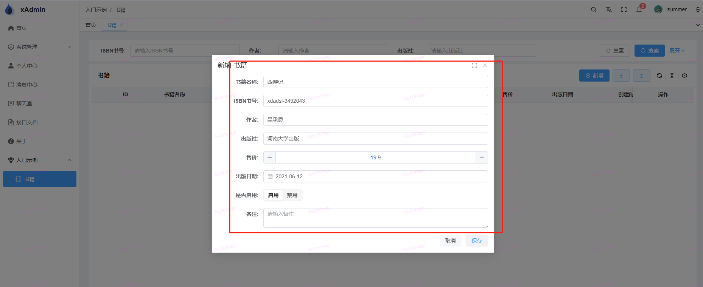
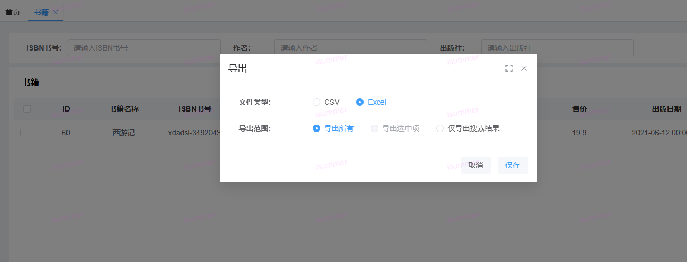
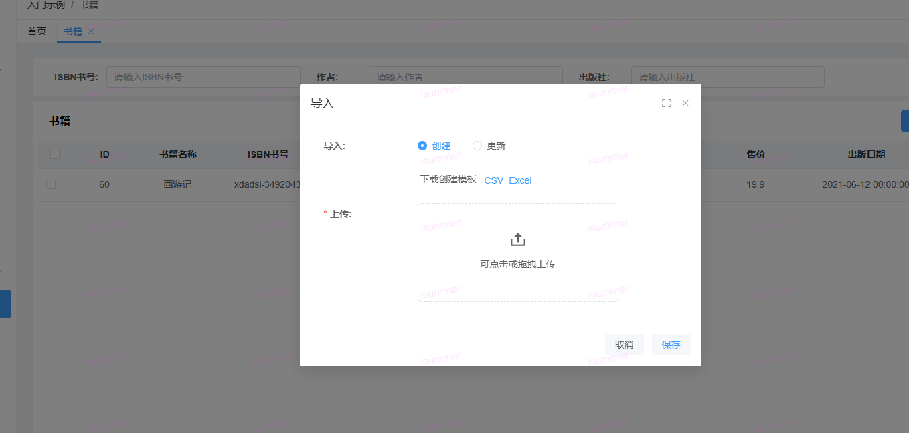
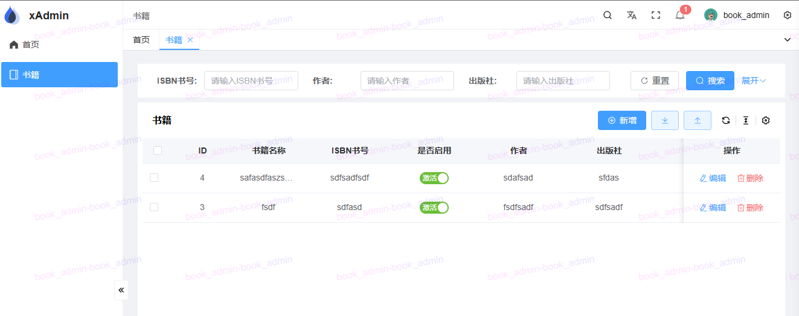

# 测试（后端 / 前端 / E2E）

> 本仓红线纪律：**新功能 100% 携带测试**（单测或 E2E），CI 阻断；改动后端后必须跑
> `pnpm test:e2e:fresh`（防止旧进程假失败）。本章给出三类测试的最小上手范式，
> 全部可在仓库内找到真实范例。

## 1. 后端（pytest）

### 目录与分工

| 位置 | 定位 | 示例 |
|------|------|------|
| `tests/unit/<app>/` | 单元测试：模型/工具/序列化器/视图分支 | `tests/unit/system/test_approval.py`（31+ 用例） |
| `tests/integration/` | 集成测试：多模块协作 / 真实 API 链路 | `tests/integration/test_mfa_api.py`（v2 密文走真实登录链路） |
| `tests/unit/common/test_contract_schemas.py` | 前后端协议契约门禁（jsonschema 校验真实响应） | 新增协议先改 `docs/schema/` 再补这里 |

### 现成夹具（tests/conftest.py，直接当参数用）

- `superuser` / `normal_user`：预置用户（normal_user 自动挂 `role`）；
- `role`：可授权角色的空壳；
- `menu_factory`：动态建菜单（权限码/路径/方法可传参），配合授权反查用例。

### 两种驱动方式

```python
# 方式一：APIRequestFactory 直驱视图（快，适合权限矩阵/分支覆盖）
from rest_framework.test import APIRequestFactory, force_authenticate
request = factory.get("/api/demo/book")
force_authenticate(request, user=superuser)
response = BookViewSet.as_view({"get": "list"})(request)
assert response.data["code"] == 1000

# 方式二：APIClient 走全链路（认证/中间件/渲染全生效，适合端到端语义）
```

真实范例：`tests/unit/system/test_approval.py`（拦截/消费/并发防护）、
`tests/unit/common/test_metadata_schema.py`（元数据契约）。

### 运行

```shell
pytest -q                          # 全量（约 40s / 1300+ 用例）
pytest -n auto -q                  # 并行（CI 同款）
pytest --cov --cov-fail-under=55   # 覆盖率门禁
```

注意：默认 sqlite `:memory:` 测试库，勿依赖 `select_for_update` 等 MySQL 专属语义
（并发防护请用条件更新 CAS，参考 `system/utils/approval.py`）。

## 2. 前端（vitest）

纯函数/composable 用**就近 spec**（与源码同目录 `*.spec.ts`），API 层用 `vi.mock` 打桩：

```ts
// src/utils/taskCenter.spec.ts 风格
vi.mock("@/api/system/task", () => ({ taskExecutionApi: { stats: vi.fn() } }));
```

组件/生命周期类测试用 `@vue/test-utils` 挂载（见 `src/utils/approvalBadge.spec.ts`）。
运行：`pnpm test:run`（全量）/ `pnpm vitest run <file>`（单文件）。

## 3. E2E（playwright）

- 用例在 client 仓库 `e2e/*.e2e.ts`，按域归类（认证/CRUD/异步任务/实时/预览）；
- 公共函数在 `e2e/helpers.ts`：`login(page)`（hash 路由，30s 宽限）、`openMenu`、`logout`；
- 种子账号 admin/admin123；运行：

```shell
pnpm test:e2e:fresh                # 杀旧进程后全量（约 12 分钟 / 200 例）
pnpm test:e2e:fresh approval task  # 只跑受影响域
pnpm test:e2e:parallel             # 4 分片并行（~4 分钟）
```

webkit 偶发 flaky 按纪律**隔离重跑确认**后再定性（见 `e2e/README.md` 教训表）。

## 4. 效果验证（手工回归）

完成前三章后，用普通用户做一次端到端验收：





## 普通用户登录


OK，基础教程到此结束。框架更深的能力（回收站/导入导出/审批挂接/WS 推送/任务与通知）
见 server `docs/architecture/` 对应篇章；二开问题优先对照 CONTRIBUTING 门禁清单自查。
