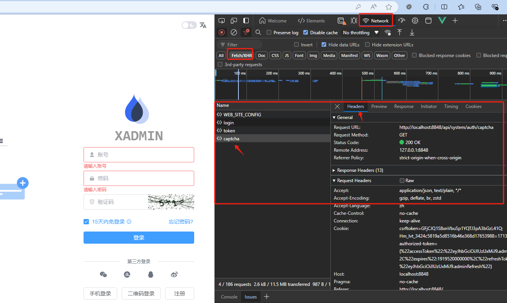
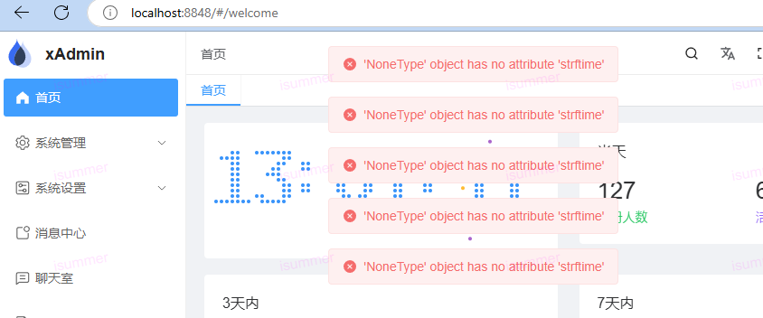
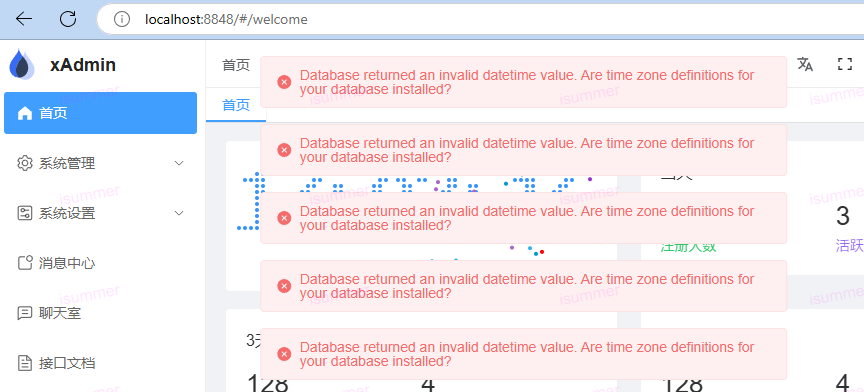
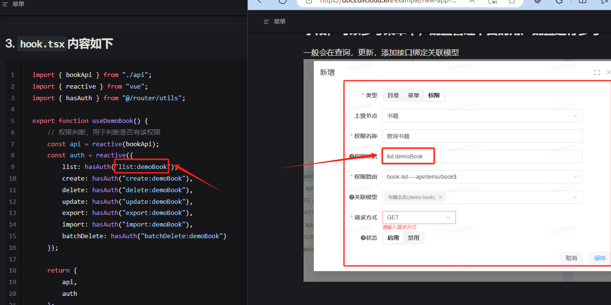
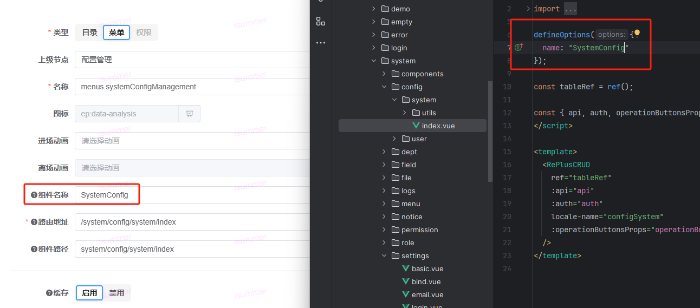
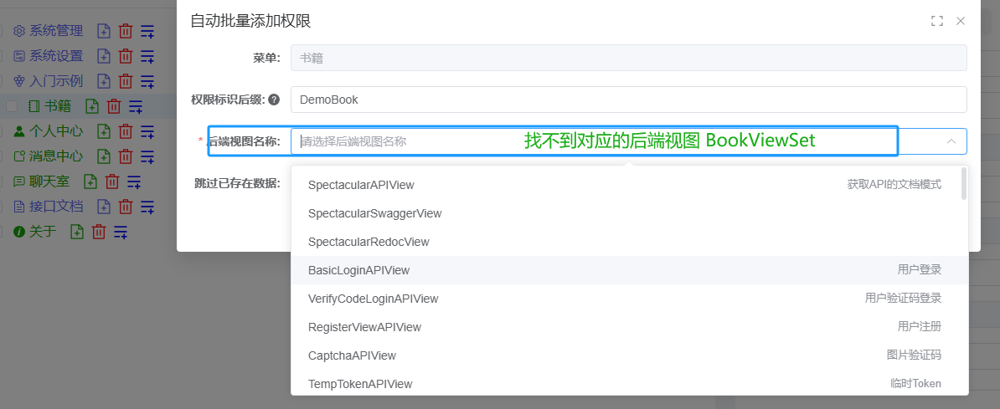
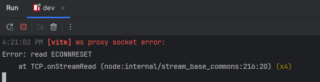

## 1. 前端不显示验证码或者提示服务器不允许登录，或者接口文档打开异常

- a.可能是后端api服务未启动
- b.前端未使用代理访问，出现跨域问题，代理需要在```vite.config.ts```中配置```proxy```字段

如何解决： 浏览器F12进行调试模式，查看下请求是否正常


## 2. 后端api服务已经启动，却无法正常访问

- a.后端服务不要使用常见端口启动，不建议使用80，8080，8000等常见端口，这些端口可能和本机所在端口冲突，导致无法访问
- b.请先配置好后端服务所需的数据库和redis服务，否则无法正常访问

## 3. 新增应用之后，菜单权限或数据权限中不显示对应的字段或模型

- a. 确保该应用已经添加到 ```config.yml```中 ```XADMIN_APPS``` 中
- b.1 添加应用之后，或者修改字段 需要执行数据库迁移命令```python manage.py sync_model_field```
- b.2 或者 在前端页面-设置-字段管理中，点击重新生成字段数据（和上面命令一样，b.1和b.2选择其中一个执行）
- c. 上述操作之后，记得刷新下前端页面 ！！！

## 4. 服务器国际化不生效
- a. 执行命令 ```python manage.py compilemessages```

## 5.项目使用mariadb|mysql数据库，访问首页 提示报错




- a. 这种一般是数据库未设置时区数据，可参考文档 [官方文档](https://mariadb.com/kb/en/mariadb-tzinfo-to-sql/)，或者进行
  mariadb 部署的服务器或者容器，执行下面命令
##### 使用mariadb执行
```shell
mariadb-tzinfo-to-sql /usr/share/zoneinfo | mariadb -u root mysql
```
##### 使用mysql执行
```shell
mysql-tzinfo-to-sql /usr/share/zoneinfo | mysql -u root mysql
```
## 6.Demo例子运行一切正常，但按这个例子自己做了一个新的，结果前端页面没有任何显示，但查看后台返回的3个API返回结果都正常

- a. 这种一般是菜单定义的权限和前端代码里面的auth权限不一致导致的
  

## 7.菜单开启缓存未生效

- a.菜单里面定义的组件名要和 前端里面定义的组件名一致
  

## 7.非默认的80，443端口，导致头像等图片文件资源无法使用
- 参考文档 NGINX部署 ```#proxy_set_header X-Forwarded-Host $host:$server_port;  # 非默认的80，443端口，则需要打开该配置```

## 8.菜单中，批量添加权限，后端视图找不到



- a.修改后端配置或代码之后，一定要重启后端的Django服务，然后刷新前端页面

## 9.开发阶段，ws报错



- a.可能是server未开启debug， 将```config.yml```中```# DEBUG: true```修改为```DEBUG: true```