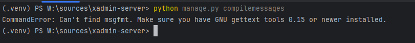
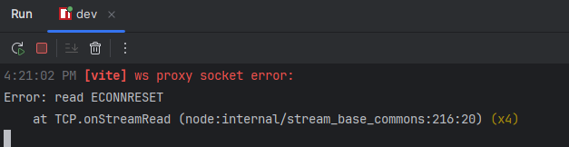
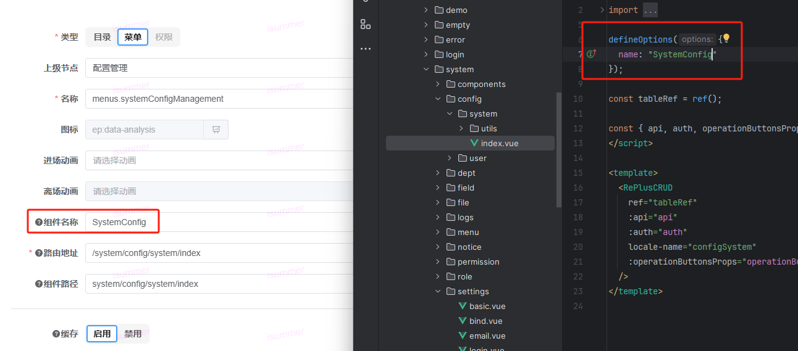
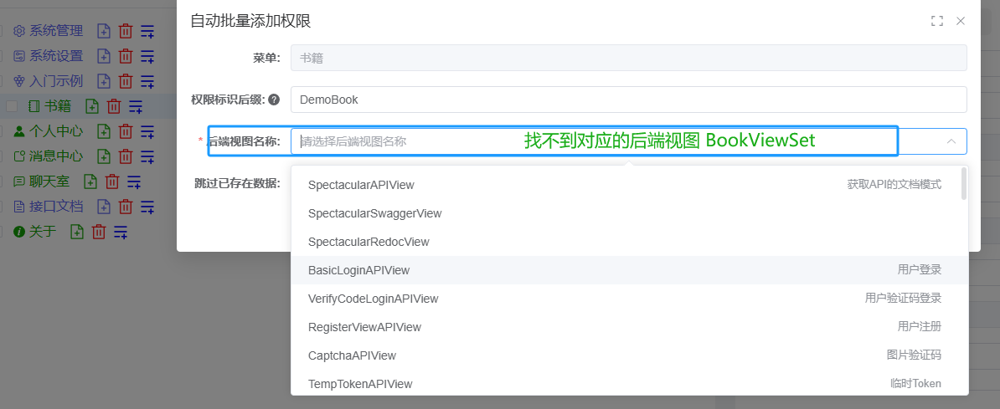
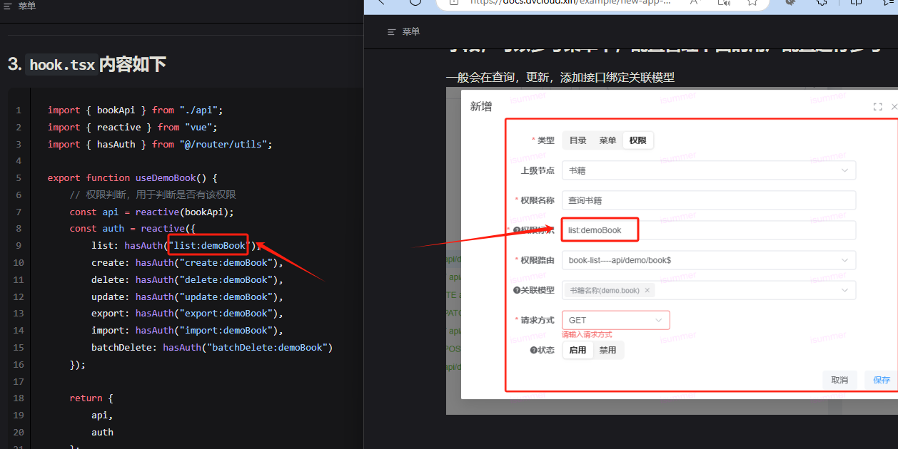
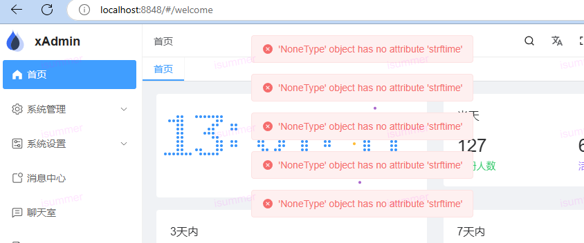
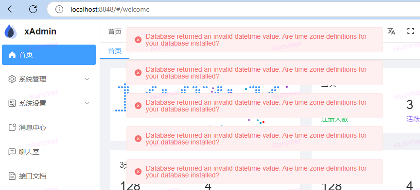

# 常见问题

> 本文覆盖"装不上 / 起不来 / 配置不生效"类问题；**开发期的高频坑**（元数据缺列、权限码、
> 渲染器注册、静默失败等）见权威清单
> [dev-pitfalls（24 条，持续更新）](https://github.com/nineaiyu/xadmin-server/blob/dev/docs/dev-pitfalls.md)。
> 一条命令自检：`python manage.py doctor`（密钥 / DB / Redis / 语言包 / 权限点 / 模块 / 契约，附修复命令）。

## 一、安装与启动

### 1. 前端不显示验证码 / 提示「服务器不允许登录」/ 接口文档异常

- 后端 API 服务未启动或端口不通：确认后端已启动（默认 `8896`），
  `curl http://127.0.0.1:8896/api/common/api/health` 返回 ok；
- 前端开发代理**默认已配置**（指向 `127.0.0.1:8896`），后端不在默认端口时用环境变量
  `E2E_API_PORT` 覆盖代理目标；浏览器 F12 查看请求是否正常。

### 2. 后端 API 已启动，却无法正常访问

- 避免使用 80 / 8080 / 8000 等常见端口（易与本机其它服务冲突），默认用 `8896`；
- 确认数据库与 Redis 已就绪（本地开发可 `bash utils/dev_up.sh --backend-only` 一键起依赖）。

### 3. Ubuntu 无法正常安装 requirements.txt 依赖

- 参考 server 源码 `Dockerfile-base` 的依赖，或手动执行：
  `apt-get install libmariadb-dev gettext pkg-config make g++`。

### 4. Windows 提示 `Can't find msgfmt`

```text
CommandError: Can't find msgfmt. Make sure you have GNU gettext tools 0.15 or newer installed.
```



- 安装 [gettext](https://github.com/mlocati/gettext-iconv-windows/releases/download/v0.23-v1.17/gettext0.23-iconv1.17-shared-64.exe)
  后重启编辑器即可（Windows 平台为有限支持，任务监控命令不可用）。

### 5. 开发阶段 WS（WebSocket）报错



- 将 `config.yml` 中的 `# DEBUG: true` 改为 `DEBUG: true`（开发态才启用 WS 调试信息）。

## 二、配置不生效

### 6. 新增应用后，菜单权限 / 数据权限里不显示字段或模型

- 确认应用已加入 `config.yml` 的 `XADMIN_APPS`；
- 执行 `python manage.py sync_model_field`（或前端「字段管理 → 重新生成字段数据」，二选一）；
- 刷新前端页面（改配置/代码后必须**重启后端进程**，挂载代码不热加载）。

### 7. 服务器国际化不生效

- 执行 `python manage.py compilemessages` 编译语言包；
  升级后可直接跑 `python manage.py post_upgrade`（种子 + 语言包 + 缓存 + 权限扫描一键处理）。

### 8. 菜单缓存未生效 / 权限关联时找不到对应模型

- 菜单里定义的**组件名**要与前端 `defineOptions({ name })` 一致，权限码为 `动作:组件名`；
- 找不到模型时检查对应 ViewSet 的 `serializer_class` 是否继承 `BaseModelSerializer`，
  然后在前端执行：① 字段管理「重新生成字段数据」；② 菜单「重新生成对应权限」。



### 9. 批量添加权限后后端视图找不到 / 改代码后行为没变



- 修改后端配置或代码之后，一定**重启后端 Django 服务**（容器：`docker compose restart server celery-worker celery-heavy celery-beat`），然后刷新前端页面。

## 三、运行时与部署

### 10. 仿写 demo 后前端页面没有任何显示，但接口返回都正常



- 一般是菜单权限码与前端组件 `name` 不一致（`hasAuth("动作:组件名")` 为假 → 页面不渲染）；
- 权限码与组件名必须**一字不差**，排查见 [dev-pitfalls #2](https://github.com/nineaiyu/xadmin-server/blob/dev/docs/dev-pitfalls.md)。

### 11. 使用 MariaDB / MySQL 时访问首页报错




- 一般是数据库未设置时区数据，参考 [MariaDB 时区文档](https://mariadb.com/kb/en/mariadb-tzinfo-to-sql/)，
  在数据库服务器 / 容器内执行：

```shell
# mariadb
mariadb-tzinfo-to-sql /usr/share/zoneinfo | mariadb -u root mysql
# mysql
mysql-tzinfo-to-sql /usr/share/zoneinfo | mysql -u root mysql
```

### 12. 非 80 / 443 端口下，头像等图片文件资源不可用

- 参考 [NGINX 部署](/guide/installation-nginx) 中的
  `proxy_set_header X-Forwarded-Host $host:$server_port;`（非标准端口时需打开该配置）。

## 更多资料

- 生产部署与配置速查：[部署与运维手册](https://github.com/nineaiyu/xadmin-server/blob/dev/docs/ops/deployment.md)；
- 故障处置步骤（服务起不来 / 任务积压 / 磁盘告警等）：[runbook](https://github.com/nineaiyu/xadmin-server/blob/dev/docs/ops/runbook.md)；
- 备份 / 恢复 / 时间点恢复（PITR）：[pitr.md](https://github.com/nineaiyu/xadmin-server/blob/dev/docs/ops/pitr.md)；
- 安装器命令与常见问题：[安装器 FAQ](/problem/installer)；
- 开发期高频坑（静默失败类）：[dev-pitfalls](https://github.com/nineaiyu/xadmin-server/blob/dev/docs/dev-pitfalls.md)。
